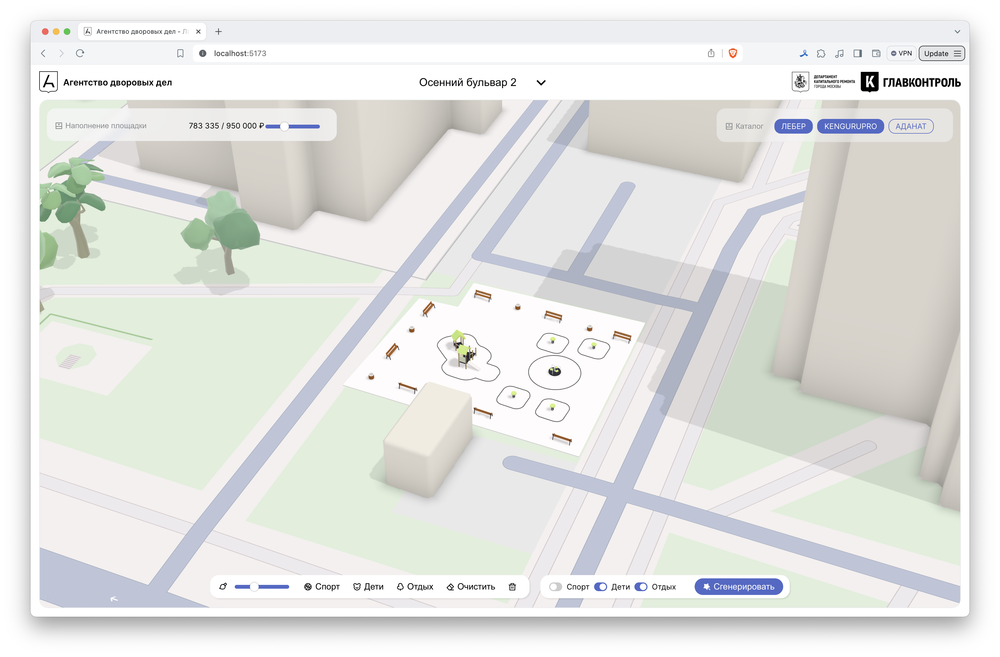

# Агентство дворовых дел

Демо: [http://www.dvorov.tech](http://www.dvorov.tech)



### Стек технологий

TypeScript, React, Three.js, Python, самописные алгоритмы

### Обзор кода

0. Обрабатываем исходные данные [server/data/process.py](server/data/process.py)
1. Определяем начальные параметры проектов и каталога [server/service/state.py](server/service/state.py)
2. Настраиваем отображение 3D сцены [web/src/view.ts](web/src/view.ts)
3. Определяем клиент-серверное API [web/src/api.ts](web/src/api.ts) 
4. Билдим клиентскую часть [web/src/App.tsx](web/src/App.tsx)
5. Запускаем сервер [server/service/app.py](server/service/app.py)


### Deploy
```
apt-get update
apt-get install git

sudo add-apt-repository ppa:deadsnakes/ppa -y
sudo apt update
sudo apt install python3.12
sudo apt install python3-pip

git clone https://github.com/lebedec/add.git
cd add/server
pip3 install -r requirements.txt

$(uvicorn service.app:app --port 80 --host 0.0.0.0 --log-level error 2>&1 > logs.txt) &

ps -eo pid,comm,lstart,etime,time,args | grep uvicorn
```